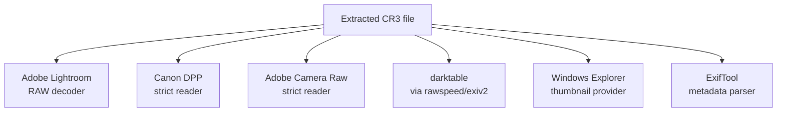

# 1. CR3 burst rolls — overview

## 1.1 What is a CR3 burst roll?

Canon mirrorless bodies (R5, R6 series, R3, R7…) have a **RAW Burst** mode that captures a sequence of frames into a **single CR3 container file** rather than producing one file per frame. The roll is named with a `CSI_` prefix on the camera (e.g. `CSI_0001.CR3`), or in our test data simply `375A4182.CR3`.

A roll typically contains:

- Tens of frames (the test data `375A4182.CR3` contains 39 frames).
- Each frame has a full-resolution RAW (compressed using Canon's **CRX** codec), a smaller CRX-encoded preview, and a JPEG embedded preview.
- A **single** set of camera-level metadata (EXIF, MakerNotes, GPS) shared across all frames.
- A **single** small thumbnail (THMB) and a single large preview (PRVW) — both representing **frame 0 of the roll**, not every frame.

The body writes this entire structure in one shutter operation. When you offload the card, you get one ~600 MB `.CR3` for a 40-frame burst instead of 40 separate files.

## 1.2 Why "extraction" is needed

Adobe Lightroom, darktable, Capture One and most other RAW developers do **not** know about Canon's burst rolls. They treat the file as a single image and only ever decode the first frame, throwing the other 39 frames away. Canon's own **Digital Photo Professional (DPP)** can extract individual frames from a roll, but it's slow and requires opening each roll by hand — which doesn't scale to thousands of bursts shot over a season.

The purpose of this tool is to produce, for each frame in a roll, a **fully standalone CR3 file** that any RAW developer can open as if it had been shot as a single frame.

## 1.3 What "standalone" really means

A standalone single-frame CR3 needs to satisfy multiple consumers:



Each consumer reads the file differently:

| Consumer | What it reads first |
| --- | --- |
| Lightroom thumbnail grid | THMB (small JPEG inside `moov.uuid`) |
| Lightroom develop view | CRX-big RAW (track 3 sample) + EXIF in CMT1 |
| DPP thumbnail grid | THMB |
| DPP edit view | CRX-big RAW + Canon MakerNote in CMT3 |
| Explorer thumbs | THMB or EXIF IFD1 thumbnail |
| ExifTool | TIFF IFDs in CMT1..CMT4 |

So an extraction has to leave every one of those structures pointing at the right per-frame data, with the right sizes, valid box headers, and valid offsets. Get any one of them wrong and the downstream tool falls back to slow paths (re-decoding the RAW for a thumbnail) or refuses the file outright (DPP's `?` placeholder).

## 1.4 What a successful extraction looks like

Given a 39-frame burst `375A4182.CR3`:

```
375A4182.CR3                      ← 590 MB burst roll (source)

after extraction:

375A4182/                         ← sibling folder created by the tool
├── 375A4182_01.CR3                ← ~16 MB standalone CR3 for frame 1
├── 375A4182_02.CR3                ← ~16 MB standalone CR3 for frame 2
├── 375A4182_03.CR3
├── ...
└── 375A4182_39.CR3
```

Each output file:

- Opens in **Lightroom** and shows the correct per-frame preview in the grid.
- Opens in **Canon DPP** for thumbnails (full-edit view is still pending — see [§6](06-extraction-and-dpp-parity.md)).
- Contains the same per-frame **CRX-big RAW bytes** that DPP would produce when extracting the same frame.
- Carries the same **EXIF / GPS / CNCV metadata** as DPP's output.
- Is **~16 MB** instead of the burst's ~590 MB — the moov is rebuilt with single-sample tables and only the chosen frame's mdat bytes are kept.

### Original burst handling — user choice

The main window has a **"Move originals to backup folder"** checkbox that controls what happens to the source burst file after its frames have been written:

| Checkbox | Behaviour |
| --- | --- |
| **Ticked** | The original burst is moved into the configured Backup folder once all its frames have been written successfully. Workflow is non-destructive — the burst is preserved, just relocated. The Backup folder is required to be set. |
| **Unticked** | The original burst stays in its original directory, next to the new sub-folder of extracted frames. The Backup folder field is greyed out and not required. Useful when offloading from a card directly and you want a single tree to keep both the burst and its extracted frames together. |

When the checkbox is ticked, files already located inside the Backup folder are excluded from the recursive scan so re-runs don't reprocess already-archived rolls. When it's unticked, that exclusion is naturally not needed — the extracted single-frame `.CR3`s in the sub-folder *would* be re-scanned, but they're pre-seeded into the non-burst cache at extraction time so a second scan recognises them as single-frame and skips them silently.

## 1.5 Test data referenced throughout these docs

The test project ships with two real bursts and several DPP-extracted reference frames for cross-checking:

| Burst | Frames | DPP references in `TestBurst/` |
| --- | --- | --- |
| `375A4182.CR3` (590 MB) | 39 | `375A4182_01.CR3`, `_02`, `_03`, `_04`, `_11` |
| `375A7575.CR3` (340 MB) | unknown | `375A7575_06.CR3`, `_10.CR3` |

These are excluded from git via `.gitignore` (`*.CR3`) because they are too large; they live locally in `Cr3BurstExtractor.Tests/TestBurst/`. The diagnostic tests in `ExtractionTests.cs` rely on them.

## 1.6 What you'll find in the rest of these docs

- The next chapter ([02-isobmff-primer.md](02-isobmff-primer.md)) is a quick refresher on ISO BMFF box format — necessary because the CR3 container reuses MP4's structure.
- After that we walk top-down through the actual CR3 layout: file-level structure → moov internals → sample tables → preview boxes → metadata boxes.
- Chapter 6 ([06-extraction-and-dpp-parity.md](06-extraction-and-dpp-parity.md)) ties everything together with our extraction algorithm and known divergences from DPP.

If you only have time for one chapter, start with [03-file-structure.md](03-file-structure.md) and refer back to the ISOBMFF primer when something feels unexplained.
