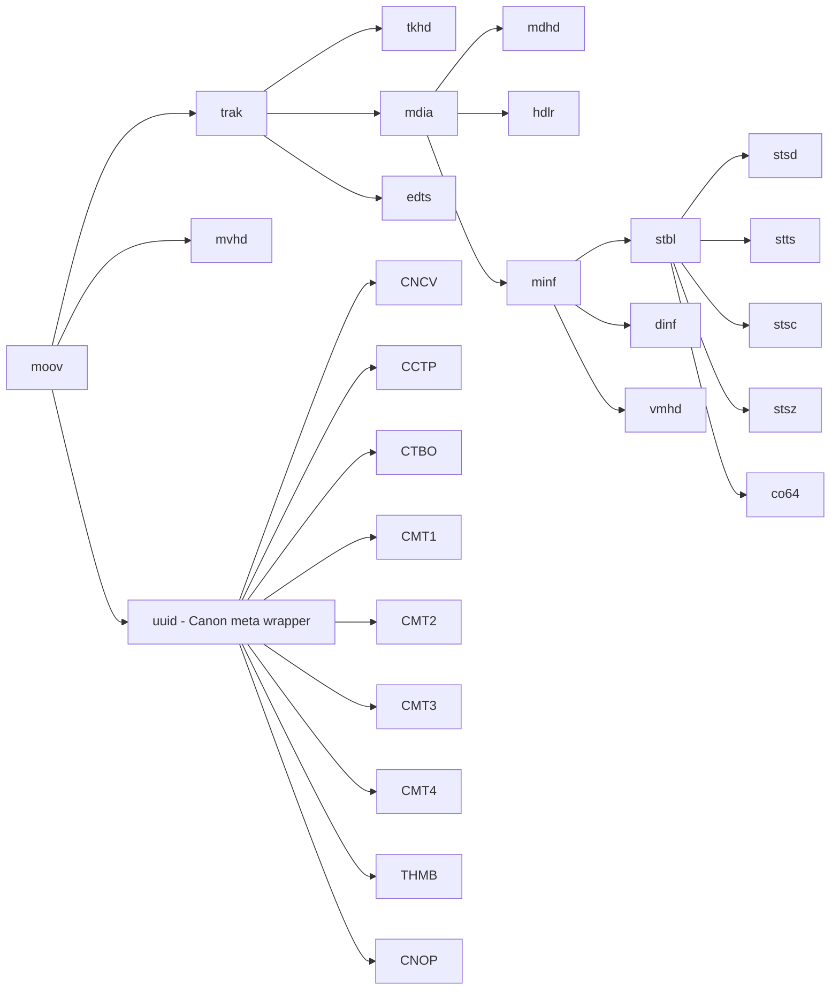

# 2. ISO BMFF primer

CR3 is built on the **ISO Base Media File Format** (ISO/IEC 14496-12), the same container family MP4, MOV, HEIC and CR2's successor share. This chapter is a fast reference for the box format itself — enough to read everything in the chapters that follow.

## 2.1 The box (a.k.a. atom)

The whole format is a tree of **boxes**. Every box on disk has this header:

```
+---------------------+----------------------+--------+----------------+
| 4 bytes: box size   | 4 bytes: box type    | (data) |  (child boxes) |
| (big-endian uint32) | (ASCII e.g. 'moov')  |        |                |
+---------------------+----------------------+--------+----------------+
```

So the minimum box is 8 bytes (header only, empty payload).

### Size field semantics

| Size value | Meaning |
| --- | --- |
| `n > 8` | Total bytes including the 8-byte header. The box covers offsets `[start, start + n)`. |
| `1` | Extended size: the **next 8 bytes** after the type form a 64-bit big-endian length. Used for boxes > 4 GiB (e.g. very large `mdat`). |
| `0` | Box runs to the end of the enclosing container (top-level box runs to EOF). Rare in practice for CR3. |

### Type field

A 4-byte ASCII identifier such as `ftyp`, `moov`, `trak`, `stsd`, `mdat`. Case-sensitive. Canon's custom box types are uppercase (`CMT1`, `THMB`, `CCTP`, `CNCV`, …) and the standard ISO BMFF types are lowercase.

There is one exception: `uuid` boxes have a standard 4-byte type of `'uuid'` but their actual identity is a **16-byte UUID** placed immediately after the box header. We'll cover this in §2.3.

## 2.2 Byte order

Everything outside a JPEG payload is **big-endian** unless explicitly noted. That includes:

- The 4-byte and 8-byte box size fields.
- All field values inside ISO BMFF boxes (timestamps, offsets, etc.).
- Sample tables, durations, dimensions in `mvhd`, `tkhd`, `mdhd`.

The TIFF/EXIF block inside `CMT1`/`CMT2`/`CMT3`/`CMT4` is the **one exception** — TIFF has its own byte-order mark (`II` = little-endian, `MM` = big-endian) and the entire IFD chain follows that order. Canon's R6 Mark II uses `II` (little-endian) for the TIFF blocks.

## 2.3 Container boxes vs leaf boxes

Some boxes contain child boxes (with the same header format) directly after their type field. Others contain raw payload data. There's no flag for this — you have to know per box type whether it's a container.

In CR3, the container box types are:



The "leaf" boxes (no child boxes inside) we care about: `ftyp`, `mdat`, `mvhd`, `tkhd`, `mdhd`, `hdlr`, `stsd`, `stts`, `stsc`, `stsz`, `co64`, `stco`, `vmhd`, `THMB`, `CNCV`, `CCTP`, `CTBO`, `CMT1..4`, `CNOP`.

## 2.4 The `uuid` extension box

`uuid` is the ISO BMFF escape hatch for vendor extensions. The layout is:

```
+---------+--------+-----------+-------------------+
| 4 size  | 'uuid' | 16 bytes  |  (payload — can   |
|         | (4)    | UUID      |  be raw bytes or  |
|         |        | identifier|  nested boxes)    |
+---------+--------+-----------+-------------------+
```

Three `uuid` boxes appear in a CR3 burst, and a fourth is wrapped inside `moov`. Each is identified by its 16-byte UUID:

| 16-byte UUID (hex) | Where it lives | Purpose |
| --- | --- | --- |
| `85c0b687-820f-11e0-8111-f4ce462b6a48` | Inside `moov` (first child) | Canon metadata wrapper — contains `CMT1..4`, `THMB`, etc. |
| `be7acfcb-97a9-42e8-9c71-999491e3afac` | Top level (between `moov` and `mdat`) | Standard XMP metadata |
| `eaf42b5e-1c98-4b88-b9fb-b7dc406e4d16` | Top level | Canon PRVW — large preview JPEG wrapped in its own inner `PRVW` box |
| `5766b829-bb6a-47c5-bcfb-8b9f2260d06d` | Top level | Canon CMTA-like — content not yet decoded by this project, but byte-identical between roll and per-frame extractions |
| `210f1687-9149-11e4-8111-00242131fce4` | Top level, at file tail (DPP-extracted files only) | Appears to be a DPP-specific recipe / sidecar block. Not present in burst rolls. |

The UUID is what distinguishes "Canon CMT wrapper" from "XMP metadata" — they both look the same on the surface (`uuid` box header) but have entirely different payloads.

## 2.5 Parsing strategy used by this project

`Helpers/BoxParser.cs` walks the box tree linearly:

1. Read 4-byte size + 4-byte type at the current cursor.
2. Handle the size-1 (extended 64-bit) and size-0 (run-to-end) edge cases.
3. Record the box's start offset and total size.
4. If the box is a **known container** (`IsContainer(type)` returns true for `moov`, `trak`, `mdia`, `minf`, `stbl`, `dinf`, `edts`, `udta`, `meta`, `mvex`, `traf`, `moof`), recurse into its children.
5. Skip the box's bytes and continue.

For `uuid` containers, the parser descends but skips the first 16 bytes (the UUID) before recursing. This is why finding `THMB` requires going `moov` → `uuid` (Canon wrapper, skip 16) → `THMB`.

`Helpers/BoxQuery.cs` provides convenience lookups (`GetStbl`, `FindFirst`, `FindAll`, `CollectMdat`, `ReadSlice`, `GetRawBox`).

## 2.6 Example byte-level box

To make this concrete, here are the **first 24 bytes** of a real burst file (`375A4182.CR3`):

```
Offset  Hex                                       ASCII
+00     00 00 00 18 66 74 79 70  63 72 78 20 00 00 00 01   ....ftyp crx ....
+10     63 72 78 20 69 73 6f 6d                            crx isom
```

Decoded:

- `00 00 00 18` → box size = 24
- `66 74 79 70` → box type = `'ftyp'`
- `63 72 78 20` → major brand = `'crx '` (note trailing space — common in 4-byte brands)
- `00 00 00 01` → minor version = 1
- `63 72 78 20` → compatible brand = `'crx '`
- `69 73 6f 6d` → compatible brand = `'isom'`

So the file declares itself as a CR3 (`crx`) container, compatible with ISO BMFF (`isom`). Total `ftyp` box: 24 bytes.

The next box starts at offset 24 — that's `moov`.

## 2.7 Other boxes we don't touch

A burst file also contains `free` padding boxes (literally "this space intentionally left blank"; readers skip them) and a `mvex` / `traf` / `moof` family (movie fragments) — neither appears in the CR3 rolls we've inspected, so we don't handle them in this project.

For everything else, see the chapter map in [README.md](README.md).
