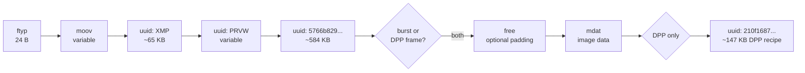
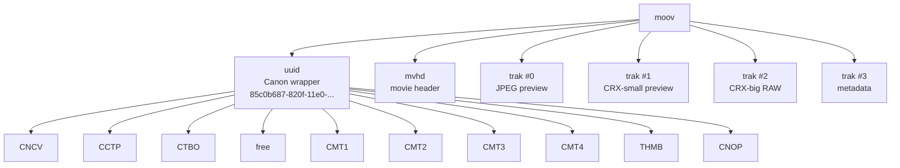
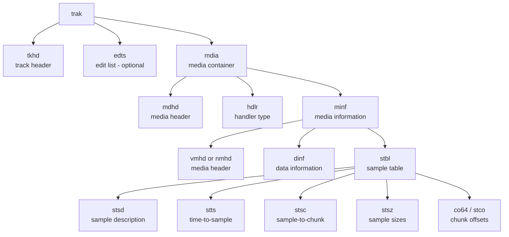

# 3. CR3 file structure

This chapter is a top-down byte-level walk of a CR3 burst file. Numbers come from running `Diagnose_DumpDppBoxStructure` against the test burst `375A4182.CR3` (39 frames, 590 MB).

## 3.1 Top-level box order

Every CR3 file we have observed (both burst rolls and DPP-extracted single frames) follows this top-level order:



Concrete numbers from the test files:

| Box | Burst `375A4182.CR3` | DPP `375A4182_01.CR3` | OURS `375A4182_01.CR3` |
| --- | --- | --- | --- |
| `ftyp` | 24 B at offset 0 | 24 B | 24 B |
| `moov` | 56,200 B at offset 24 | 47,684 B | 54,420 B |
| `uuid` (XMP) | 65,560 B | 65,560 B | 65,560 B |
| `uuid` (PRVW) | 317,064 B | 73,536 B | 316,945 B |
| `uuid` (5766b829…) | 584,224 B | 584,224 B | 584,224 B |
| `free` | 25,488 B padding | 25,488 B | absent |
| `mdat` | 588,814,040 B (all 39 frames) | 15,097,983 B | 15,097,983 B |
| trailing `uuid` (210f1687…) | absent | 147,094 B | absent |

The pattern: burst rolls have one huge `mdat` containing every frame's samples concatenated; DPP and our extractor produce a small `mdat` containing only the chosen frame's samples; DPP also appends a 147 KB trailer block we don't yet write.

## 3.2 `ftyp` — file type box

The very first box. Always exactly **24 bytes** in a CR3:

```
+00  size = 0x00000018 (24)
+04  'ftyp'
+08  major brand: 'crx '
+12  minor version: 0x00000001
+16  compatible brand: 'crx '
+20  compatible brand: 'isom'
```

Our extractor reproduces this exact layout via `Helpers/SampleTableWriter.WriteFtyp`. Some readers also accept `'qt  '` or longer brand lists; we deliberately keep the brand list minimal to match Canon DPP's output.

## 3.3 `moov` — movie box

This is the "header" of the file: it describes every track, its codec, its sample timing, and a Canon-specific metadata wrapper. It does **not** contain the image bytes themselves — those live in `mdat`. `moov` only references them via 64-bit absolute file offsets (in `co64` boxes).

A burst's `moov` differs from a DPP-extracted frame's `moov` in three ways:

1. Each `trak` has **N samples** in its sample table (burst) vs **1 sample** (DPP/ours).
2. Each `mdhd`/`tkhd`/`mvhd` declares a **multi-frame duration** vs **1-frame**.
3. The `THMB` box inside `moov.uuid` is **roll-level (frame 0)** in a burst vs **per-frame** in DPP's output.

The internal structure of `moov` is the subject of the entire next chapter ([04-sample-tables.md](04-sample-tables.md) for sample tables, [05-previews-and-metadata.md](05-previews-and-metadata.md) for THMB / CMT*).

### moov's children, in order



The `uuid` wrapper comes first inside `moov` (it's a Canon convention; ISO BMFF doesn't mandate child order). `mvhd` is the movie header. Then four `trak` boxes describe the four parallel streams.

### `mvhd` — movie header

A 108-byte fixed-layout box (in the version we see). Key fields:

- `timescale` (4 B): movie-level timebase. We preserve this verbatim.
- `duration` (4 B): total movie length in `timescale` units. **In a burst this spans all frames**; if you leave it that long after trimming to a single sample table, Adobe treats the file as a video and refuses to develop the RAW.

`MoovBuilder.BuildPatched` rewrites this duration to a single frame's worth via `BoxPatcher.PatchDuration(... DurField.Mvhd)`.

### `trak` boxes

Each `trak` is a parallel media stream. In a CR3:

| trak # | hdlr type | What's in the samples |
| --- | --- | --- |
| 0 | `vide` | JPEG frames (one full-size embedded preview per burst frame) |
| 1 | `vide` | CRX-small frames (smaller resolution, lossy CRX) |
| 2 | `vide` | CRX-big frames (the actual RAW data) |
| 3 | `meta` | Per-frame metadata — small (~hundreds of bytes per frame) |

A `trak` has this structure:



`stsd` is the codec descriptor (`CRAW` / `CMP1` / `CDI1` / `IAD1` for RAW tracks, `JPEG`-style for the preview track). It is copied **verbatim** from the burst — readers need this exactly as Canon wrote it.

The other `stbl` children describe **N samples** in a burst. We rewrite them to **1 sample**.

## 3.4 The big `mdat`

In a burst, `mdat` is a single contiguous payload containing every sample of every track. For our 39-frame test file:

- `mdat` starts at file offset 1,048,560 (right after the top-level uuids + `free` padding).
- Its declared size is 588,814,040 bytes.
- That contains 4 tracks × 39 samples = 156 sample blobs, in some order, with the `co64`/`stsz` tables in each track's `stbl` pointing to them as absolute file offsets.

Important properties:

- Samples are **not interleaved** by frame index — they're chunked by track. All of track-0's JPEG samples come first, then all of track-1's, etc. (Confirmed by reading `co64` values: they increase monotonically per track.)
- This means extracting "frame 11" really means: read `co64[10]` and `stsz[10]` from each of the four traks, slice those bytes from the burst's `mdat`, and write them into a fresh single-sample `mdat`.

A DPP-extracted single-frame file's `mdat` simply contains those four sample blobs concatenated, with each `co64`/`stco` in the new `moov` pointing at the new offset.

## 3.5 Top-level `uuid` boxes

After `moov` and before `mdat`, three `uuid` boxes carry metadata that's too big or too "vendor-specific" to fit inside `moov`:

### 3.5.1 XMP — `be7acfcb-97a9-42e8-9c71-999491e3afac`

The ISO-standard XMP metadata box. Contains an Adobe XMP packet describing the image (rating, color label, etc.) plus EXIF mirrored as RDF. **Identical in burst and per-frame outputs** — Canon doesn't per-frame this, and neither do we.

### 3.5.2 PRVW preview — `eaf42b5e-1c98-4b88-b9fb-b7dc406e4d16`

A Canon-specific UUID wrapping a larger JPEG preview (~1600×1080) that Lightroom and DPP can display before decoding the RAW. Inside the `uuid` box:

```
+00  size                       (4 B BE)
+04  'uuid'                     (4 B)
+08  16-byte UUID               (eaf42b5e-...)
+24  zero                       (4 B)
+28  inner PRVW size            (4 B BE)
+32  'PRVW'                     (4 B)
+36  version/flags = 0          (4 B)
+40  zero                       (2 B)
+42  width                      (2 B BE)
+44  height                     (2 B BE)
+46  one                        (2 B BE)  ← purpose unknown
+48  jpeg size                  (4 B BE)
+52  JPEG payload
```

Burst's PRVW is **roll-level** (frame 0's JPEG, ~300 KB). DPP rewrites this **per-frame** at a smaller ~73 KB. Our extractor rewrites it per-frame too, but stuffs the larger track-0 JPEG in (~300 KB) — see [§5](05-previews-and-metadata.md) and [§6](06-extraction-and-dpp-parity.md).

### 3.5.3 `5766b829-bb6a-47c5-bcfb-8b9f2260d06d` — Canon something

A ~584 KB Canon-specific blob. Its bytes are byte-identical between the burst, DPP-extracted frames, and our output, so we copy it verbatim. We have not decoded its content. (lclevy's docs label this as CMTA-like; it appears to be a large color-calibration / lens-profile block.)

### 3.5.4 Trailing `uuid 210f1687-9149-11e4-8111-00242131fce4` (DPP only)

A 147 KB block appended to the **end of the file** by DPP — not by the camera, not by our extractor. The UUID format follows Canon's `8111` family convention. Most likely a DPP-specific recipe/sidecar block (white-balance settings, picture-style choices, edits…). We don't write it; the file is still openable in Lightroom and (as of THMB+PRVW fixes) viewable in DPP's thumbnail grid without it. DPP's full-edit view may want it.

## 3.6 `free` — padding

`free` boxes are explicit padding. The burst leaves a `free` box between the third uuid and `mdat`, presumably to align `mdat` to a friendly boundary. DPP-extracted files preserve this; ours does not currently emit one. No reader complains about its absence.

## 3.7 Putting it all together — a complete burst file

Here's the exact byte layout of `375A4182.CR3` (the primary test burst):

| Offset | Size | Box | Notes |
| --- | --- | --- | --- |
| 0 | 24 | `ftyp` | brand `crx ` |
| 24 | 56,200 | `moov` | contains Canon wrapper + 4 traks |
| 56,224 | 65,560 | `uuid` XMP | |
| 121,784 | 317,064 | `uuid` PRVW | roll-level frame 0 JPEG |
| 438,848 | 584,224 | `uuid` 5766b829… | Canon CMTA-like |
| 1,023,072 | 25,488 | `free` | padding |
| 1,048,560 | 588,814,040 | `mdat` | all 39 frames × 4 tracks |

Total file size: 589,862,624 B ≈ 590 MB.

For a single-frame extraction (ours), the layout becomes:

| Offset | Size | Box |
| --- | --- | --- |
| 0 | 24 | `ftyp` |
| 24 | 54,420 | `moov` (rebuilt: 1-sample tables, per-frame THMB) |
| 54,444 | 65,560 | `uuid` XMP (verbatim) |
| 120,004 | 316,945 | `uuid` PRVW (per-frame rebuilt, large JPEG) |
| 436,949 | 584,224 | `uuid` 5766b829… (verbatim) |
| 1,021,173 | 15,097,983 | `mdat` (frame 11's four samples) |

Total: 16,119,156 B ≈ 16 MB.

The whole challenge of writing a correct extractor is in producing that `moov` and patching all the offsets inside it so they point at the new `mdat` layout. That's the subject of the next two chapters.
