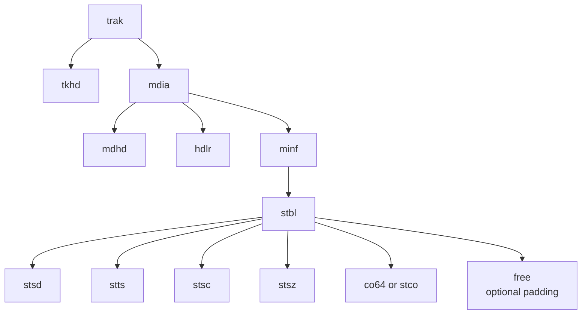
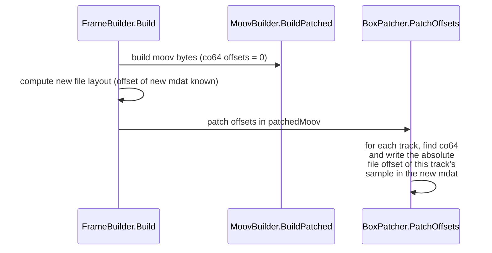
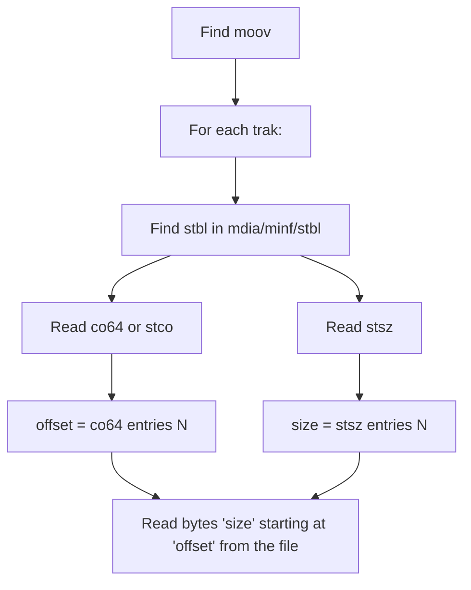

# 4. Sample tables — `stbl` and its children

Inside every `trak` lives a `stbl` (sample table) box that tells readers, for every sample in the track:

- where its bytes are in `mdat` (file offset),
- how many bytes it is (size),
- how long it is (duration in the media's timescale),
- and which `stsd` codec descriptor it uses.

For a burst roll with 39 frames per track, each `stbl` describes **39 samples**. Extracting a single frame means rewriting `stbl` to describe **1 sample**. This chapter explains every relevant child box.

## 4.1 Where `stbl` sits



Important: Canon's roll places `free` boxes **between** the sample-table children. Adobe Camera Raw's parser refuses files with `free` boxes inside `stbl`, so our `WritePatchedStbl` deliberately **drops them**. Without that, "program error" in DNG Converter.

## 4.2 `stsd` — sample description

A list of codec descriptions. For RAW tracks in a CR3 you'll find:

- `CRAW` — Canon RAW sample entry, contains nested:
  - `CMP1` — compression parameters (CRX codec config)
  - `CDI1` — Canon-specific
  - `IAD1` — Canon-specific
- For the JPEG track, a different entry containing image dimensions and compression info.

**We copy `stsd` verbatim from the burst.** Touching it would risk breaking the codec descriptor that the RAW decoder needs to interpret `mdat` bytes correctly. The single-sample tables we rewrite below reference this `stsd` by index 1.

## 4.3 `stsz` — sample sizes

Per-sample byte length. Layout:

```
+00  size + 'stsz'                       (8 B)
+08  version (1) + flags (3)             (4 B, zero)
+12  default size                        (4 B BE)
+16  sample count N                      (4 B BE)
+20  if default size == 0: N × 4 B BE sample sizes
     else: no per-sample entries (every sample is `default size`)
```

In burst rolls the default-size field is **0** and there are N per-sample sizes. Each sample size is in bytes.

`Helpers/SampleTableReader.ReadStsz` returns a `List<long>` of sample sizes. Our `Helpers/SampleTableWriter.WriteStsz` writes a single-sample form:

```
size = 20, name = 'stsz', vers/flags = 0, default = 0, count = 1, sizes[0] = the chosen frame's byte length
```

## 4.4 `stts` — time-to-sample (duration table)

Runs of equal-duration samples. For typical RAW tracks every sample has the same duration so there's a single run. Layout:

```
+00  size + 'stts'                       (8 B)
+08  version/flags                        (4 B)
+12  entry count M                        (4 B BE)
+16  M × {sample count, sample delta}    (M × 8 B)
```

For a 39-sample track with delta `d`, you'd see `entry_count=1, sample_count=39, sample_delta=d`. Our `WriteStts` emits `count=1, sample_count=1, sample_delta=d` so the single remaining sample inherits the burst's original frame duration.

We read the burst's first `stts` delta via `SampleTableReader.ReadFirstSttsDelta(src, stbl)` and reuse it — this preserves the frame rate metadata that `mdhd`/`tkhd`/`mvhd` durations are derived from.

## 4.5 `stsc` — sample-to-chunk

Tells you how samples are grouped into chunks. Layout:

```
+00  size + 'stsc'                       (8 B)
+08  version/flags                        (4 B)
+12  entry count                          (4 B BE)
+16  per-entry: {first_chunk, samples_per_chunk, sample_description_index} × 12 B
```

For a single-sample extraction this is trivial: 1 chunk, 1 sample, stsd index 1. `WriteStsc` emits exactly that.

## 4.6 `co64` / `stco` — chunk offsets

Absolute file offsets to each chunk in `mdat`. Two flavours:

- **`stco`** — 32-bit offsets. Limit: 4 GiB total file.
- **`co64`** — 64-bit offsets. Used when the file might exceed 4 GiB.

Canon's burst rolls always use **`co64`** (the burst we tested is ~590 MB, well under 4 GiB, but Canon uses `co64` unconditionally — possibly because some rolls do exceed 4 GiB). Our extractor preserves whichever was originally there: it reads with `ReadCo64 ?? ReadStco` and writes the same kind back.

`co64` layout:

```
+00  size + 'co64'                       (8 B)
+08  version/flags                        (4 B)
+12  entry count C                        (4 B BE)
+16  C × 8 B big-endian uint64 offsets
```

In a burst with 39 samples (and one sample per chunk in Canon's writer), C = 39.

For our single-sample extraction we write `entry_count = 1, offsets[0] = mdat_payload_offset_in_new_file + sample_byte_position`. But we don't actually know the final mdat offset until after the patched moov is built — chicken-and-egg.

### How we resolve the chicken-and-egg

`Managers/MoovBuilder.WritePatchedStbl` writes the `co64` with **placeholder offset = 0**. After the patched `moov` bytes have been assembled and the final layout is known, `Helpers/BoxPatcher.PatchOffsets` walks the patched moov bytes, finds each track's `co64`, and overwrites the offset with the correct value:



For a single-frame extraction with samples laid out sequentially in the new `mdat`:

```
co64[track i] = mdatPayloadOffset + sum(track 0..i-1 sample sizes)
```

That formula assumes we write samples in track order, which `FrameBuilder.Build` does (the loop over `frameSamples` writes them sequentially).

## 4.7 `mdhd` and `tkhd` durations — must match `stts`

Each track also has duration fields in `mdhd` (media-timescale) and `tkhd` (movie-timescale) that must be **consistent with the new single-sample `stts`** or readers reject the file.

The burst's `mdhd.duration` covers all N frames. After trimming the sample table to one sample, the duration needs to be one frame's worth in the media's timescale.

`MoovBuilder.BuildPatched` computes these durations up front, then `BoxPatcher.PatchDuration` rewrites the field in the appropriate offset (different for `mvhd`, `tkhd`, `mdhd`):

| Box | Where the duration lives | Units |
| --- | --- | --- |
| `mvhd` | Offset depends on version 0/1 | movie timescale |
| `tkhd` | Offset depends on version 0/1 | movie timescale |
| `mdhd` | Offset depends on version 0/1 | media timescale (per-track) |

`MoovBuilder` reads `mvhd.timescale` and each `mdhd.timescale`, multiplies the per-frame `stts` delta into both timescales, and writes:

```
mdhd.duration = delta                                (in media timescale)
tkhd.duration = delta × mvhdTimescale / mdhdTimescale (in movie timescale)
mvhd.duration = max(track durations across all traks)  (in movie timescale)
```

If you skip this, the file opens — but every metadata reader thinks it's an N-frame movie and Adobe refuses to develop the RAW as a still image.

## 4.8 Reading a sample by index

This is what every extractor (ours, DPP's, and any future one) needs to be able to do. Given a burst file and a frame index N:



`Managers/FrameBuilder.Build` does exactly this for each of the four tracks, collecting per-track sample data into `frameSamples: List<(byte[] Data, int TrakIdx)>`. Those bytes become the new `mdat`'s payload.

## 4.9 Writing a single-sample `stbl`

For each track we emit:

```
stbl
├── stsd      (verbatim from burst — codec descriptor)
├── stts      (1 entry: count=1, delta=<original frame delta>)
├── stsc      (1 entry: first_chunk=1, samples_per_chunk=1, stsd_index=1)
├── stsz      (default=0, count=1, sizes[0]=<actual byte size>)
└── co64      (count=1, offset=<placeholder 0, patched later>)
```

No `free` boxes; nothing else. After `BoxPatcher.PatchOffsets` substitutes the real offsets, the new `stbl` is a complete, valid sample table.

## 4.10 `CTBO` — container table of offsets

This isn't part of `stbl` but it lives in the same offset-management family. `CTBO` is a Canon box inside `moov.uuid` that lists, for each top-level `uuid` box (plus `mdat`), its **original** file offset and size — used by readers to find boxes without scanning. After we change the file layout, every entry in CTBO is wrong.

`Helpers/BoxPatcher.PatchCtbo(patchedMoov, offsetMap)` walks `CTBO`'s entries and rewrites each `(offset, size)` pair using `offsetMap[originalOffset] → (newOffset, newSize)`. `FrameBuilder.Build` populates that map with the entries for every kept top-level uuid plus the new `mdat`.

Without this patch CTBO points past EOF and Adobe Camera Raw refuses to decode the RAW — even though everything else in the file is correct.

## 4.11 Summary

| Box | What we do during extraction |
| --- | --- |
| `stsd` | Copy verbatim from burst |
| `stts` | Rewrite to 1 entry with original frame delta |
| `stsc` | Rewrite to 1 entry (1 chunk, 1 sample) |
| `stsz` | Rewrite to count=1 with the chosen frame's actual byte size |
| `co64` (or `stco`) | Emit with placeholder 0, then `BoxPatcher.PatchOffsets` fixes it |
| `free` inside `stbl` | Drop (Adobe Camera Raw chokes on these) |
| `mdhd`/`tkhd`/`mvhd` durations | Recompute to a single frame's duration |
| `CTBO` | Rewrite original→new offsets via `BoxPatcher.PatchCtbo` |
| `CCTP` (roll-flag inside `moov.uuid`) | Patch single-image flag (2→1) via `BoxPatcher.PatchCctp` |
