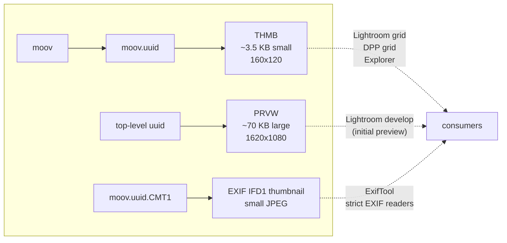

# 5. Previews and metadata boxes

Beyond the four `trak` boxes that carry the actual JPEG/CRX/RAW samples, CR3 has a constellation of preview and metadata boxes that influence how downstream tools display and decode the file. This chapter covers each one with byte-level layout.

## 5.1 The two preview JPEGs

There are **two embedded preview JPEGs** in a CR3 — different sizes, different locations, different consumers.



And actually, a **third** thumbnail can exist: inside `CMT1`'s TIFF block as an EXIF IFD1 thumbnail. In burst rolls and our output it exists; in DPP-extracted files we observe it stripped (IFD0's next-IFD-offset is zero).

## 5.2 THMB — small thumbnail inside `moov.uuid`

The most-consulted preview. File browsers, Lightroom's library grid, and DPP's grid all reach for THMB first because it's tiny and fast.

### 5.2.1 Layout (verified on R6 Mark II)

```
+00  size           (4 B BE)
+04  'THMB'         (4 B)
+08  version/flags  (4 B, zeros)
+12  width          (2 B BE, 0x00A0 = 160)
+14  height         (2 B BE, 0x0078 = 120)
+16  jpegSize       (4 B BE)
+20  constant       (4 B, observed value: 00 01 00 00)
+24  JPEG payload
```

Total header bytes before the JPEG: **24**.

The `+20` four-byte constant is `00 01 00 00` in both the burst and every DPP-extracted frame we examined. Its meaning isn't documented; we preserve it verbatim. It's almost certainly a stride / orientation / counter that Canon's loader checks.

### 5.2.2 Behaviour across our test files

| File | THMB size (total) | JPEG payload | Per-frame? |
| --- | --- | --- | --- |
| Burst `375A4182.CR3` | 10,296 B | 10,272 B | No (frame 0 only) |
| DPP `375A4182_01.CR3` | 3,560 B | 3,536 B | **Yes** (small re-encoded) |
| DPP `375A4182_04.CR3` | 3,528 B | 3,504 B | **Yes** (different bytes from frame 1) |
| OURS `375A4182_01.CR3` (current) | ~3,644 B | ~3,620 B | **Yes** (System.Drawing re-encoded) |

So DPP rewrites THMB per-frame with a small (~3.5 KB) JPEG matching the 160×120 header dimensions. Earlier attempts to stuff the full ~100 KB track-0 JPEG into THMB caused DPP to refuse the file (it allocates a small buffer based on width/height and chokes on much larger inputs). The current implementation in `Managers/ThmbBuilder.cs`:

1. Decodes the track-0 JPEG via `System.Drawing.Image.FromStream`.
2. Resizes to 160×120 with high-quality bicubic.
3. Re-encodes as JPEG at quality 80 via `ImageCodecInfo` + `EncoderParameters`.
4. **Strips JFIF `APP0` marker** (`FF D8 FF E0`) so the JPEG starts `FF D8 FF DB` like Canon's. Without this, DPP rejects the THMB and falls back to decoding the RAW for every thumbnail — making folder browsing crawl.
5. Writes the 24-byte header + the stripped JPEG.

### 5.2.3 JPEG marker order — DPP is strict

The bytes immediately after SOI (`FF D8`) matter:

| Source | First 4 bytes | Marker after SOI |
| --- | --- | --- |
| Burst's THMB | `FF D8 FF DB` | DQT (Define Quantization Table) |
| DPP frame 1's THMB | `FF D8 FF DB` | DQT |
| OURS (System.Drawing unfiltered) | `FF D8 FF E0` | JFIF APP0 → DPP rejects |
| OURS (after `StripAppMarkers`) | `FF D8 FF DB` | DQT → ✅ |

Lightroom doesn't care; DPP does. The same fix applies to PRVW (not yet implemented — see [§6](06-extraction-and-dpp-parity.md)).

## 5.3 PRVW — large preview, top-level uuid

```
+00  outer size                    (4 B BE)
+04  'uuid'                        (4 B)
+08  UUID: eaf42b5e-1c98-4b88-b9fb-b7dc406e4d16  (16 B)
+24  zero                          (4 B)
+28  inner box size                (4 B BE)
+32  'PRVW'                        (4 B)
+36  version/flags = 0             (4 B)
+40  zero                          (2 B)
+42  width                         (2 B BE)
+44  height                        (2 B BE)
+46  one                           (2 B BE)
+48  jpegSize                      (4 B BE)
+52  JPEG payload
```

Total header before JPEG: **52** bytes.

### 5.3.1 Behaviour

Burst's PRVW is the roll-level (frame 0) JPEG, ~300 KB. DPP rewrites it to ~73 KB per-frame. Our `Managers/PrvwBuilder.BuildWithJpeg` does rewrite per-frame, but currently **uses the full track-0 JPEG (~100 KB)** with no resize step. That's why our PRVW comes out at ~316 KB in the test files.

Lightroom's develop view reads this preview while it decodes the CRX RAW. DPP's behaviour is less clear — it may consult PRVW too, and the size + JFIF marker mismatch are strong suspects for the still-failing DPP edit-view ("?") symptom. Bringing PRVW into parity with DPP would mean reusing `ThmbBuilder`'s resize+strip pipeline at a larger target size.

## 5.4 The CMT* metadata boxes

Inside `moov.uuid`, Canon's CR3 carries four EXIF-family boxes:

| Box | Contains | Source standard |
| --- | --- | --- |
| `CMT1` | TIFF IFD0 (main camera EXIF) + optional IFD1 (thumbnail) | TIFF / EXIF |
| `CMT2` | EXIF SubIFD (per-shot fields: ExposureTime, FNumber, ISO, focal length, etc.) | EXIF |
| `CMT3` | Canon MakerNote (Canon-specific per-shot data: AF, picture style, lens info, processing parameters) | EXIF MakerNote |
| `CMT4` | GPS IFD (if recorded) | EXIF GPS |

Each is a `<size:4><name:4><TIFF block>` structure. The TIFF block has the standard byte-order mark (`II`/`MM`) + magic `0x002A` + IFD0 offset + IFD0 + optional IFD1.

### 5.4.1 TIFF refresher

A TIFF IFD ("Image File Directory") layout:

```
+00  entry count N        (2 B)
+02  N × 12-byte entries:
      +00  tag             (2 B)
      +02  data type       (2 B)
      +04  value count     (4 B)
      +08  value or offset (4 B — inline if it fits in 4 bytes, else offset into the TIFF block)
+02+12*N  next IFD offset (4 B; 0 = end of chain)
```

Inside CMT1, IFD0 holds main fields and links to IFD1 (thumbnail). IFD1 has its own entry list including:

- Tag `0x0201` — `JPEGInterchangeFormat` (offset to thumbnail JPEG bytes)
- Tag `0x0202` — `JPEGInterchangeFormatLength` (size of thumbnail JPEG)

The actual thumbnail JPEG sits in the TIFF block's data area at the offset given by `0x0201`.

### 5.4.2 Burst → DPP edits per box

From `Diagnose_Cmt2_OffsetSummary_BothBursts` and `Diagnose_Cmt3_OffsetSummary_BothBursts` in the test suite:

| Box | Burst → DPP frame | Behaviour |
| --- | --- | --- |
| `CMT1` | Identical | Verbatim copy (some byte ranges differ between bursts but consistent within a burst) |
| `CMT2` | ~240 bytes differ at **identical TIFF tag offsets** across different bursts (`+16, +26, +38, +110, +122, +134, +146, +158, …`) | DPP makes consistent field-level edits — same offsets every time |
| `CMT3` | ~3000-7000 bytes differ in a large block starting at **+1144** in both bursts | DPP rewrites Canon MakerNote contents — likely per-frame array elements + index updates |
| `CMT4` | Identical | Verbatim |
| `CNCV` | Identical | Verbatim (codec name version string) |

The CMT2 edits look like DPP is updating EXIF tag *values* (small, fixed-position) — possibly per-frame `DateTimeOriginal`, `ImageNumber`, `ShutterSpeedValue`, etc. The CMT3 edits look like DPP is selecting per-frame elements from arrays in the burst's MakerNote — the MakerNote contains tags whose values are N-element arrays (one element per burst frame), and DPP picks element N for frame N.

We currently **copy all four CMT boxes verbatim from the burst**, which means our CMT2/CMT3 don't match DPP byte-for-byte. The relevant tests are marked `[Theory(Skip = ...)]` until per-frame patching is implemented.

### 5.4.3 EXIF IFD1 thumbnail — present in ours, stripped in DPP

`ExtractExifIfd1ThumbnailFromCmt1` finds a JPEG via `0x0201/0x0202` tags in IFD1 in burst rolls and in our output, but **returns null for DPP-extracted frames**. DPP either zeroes IFD0's "next IFD" offset or removes the IFD1 chain entirely. The thumbnail can't have been very important — Adobe / Explorer still display previews correctly without it because THMB and PRVW are present.

We don't strip IFD1 currently. An earlier attempt to do so broke Lightroom import on the affected files; the cause was diagnosed to be the THMB rewrite from the same change set, not the IFD1 strip itself, but we have not reattempted IFD1 stripping.

## 5.5 `CNCV` — codec name / version

A short ASCII string identifying the CRX codec version Canon used. Verbatim across all files we've inspected. Copy as-is.

## 5.6 `CCTP` — content type? (Canon Control Type Properties)

A small Canon control box inside `moov.uuid`. Contains a flag that indicates whether the file is a single image or a burst roll.

`Helpers/BoxPatcher.PatchCctp` flips this flag from **2** (roll) to **1** (single image). Without that patch some readers still treat the output as a roll.

## 5.7 `CTBO` — container table of offsets

Covered in [§4.10](04-sample-tables.md#410-ctbo--container-table-of-offsets). A table of `(originalOffset, size)` entries pointing to every top-level box. Critical to patch — Adobe Camera Raw uses it as a sanity check.

## 5.8 `CNOP` — Canon "no operation"? unknown

A small box (~176 B) at the end of `moov.uuid`. Bytes are identical between burst and DPP output. Copied verbatim.

## 5.9 XMP, top-level

A standard Adobe XMP packet wrapped in a `uuid` box. ~65 KB in our test files. Identical in burst and all per-frame outputs — copy verbatim. Contains:

- A copy of EXIF as RDF triples (so XMP-only readers can extract camera info).
- Adobe-specific fields (color labels, ratings, develop settings if you've edited the file).
- Canon-specific fields (very few, mostly camera identification).

## 5.10 Summary — preview / metadata box reference

| Box | Where | Burst → per-frame? | What we do | Matches DPP? |
| --- | --- | --- | --- | --- |
| `THMB` (in `moov.uuid`) | inside `moov.uuid` | Per-frame | Decode track-0 JPEG, resize to 160×120, re-encode, strip APP markers, wrap in 24-byte THMB header | Structure ✅, bytes ✗ (different encoder produces different JPEG) |
| `PRVW` (top-level uuid) | top-level | Per-frame | Replace JPEG with track-0 JPEG (no resize/strip) | Size mismatch (ours ~300 KB vs DPP's ~73 KB) |
| `CMT1` IFD0 | inside `moov.uuid` | Verbatim | Copy verbatim | ✅ |
| `CMT1` IFD1 thumbnail | inside `moov.uuid` | DPP strips | Keep verbatim (no strip) | DPP strips, we don't |
| `CMT2` (EXIF SubIFD) | inside `moov.uuid` | DPP edits ~240 B at fixed offsets | Copy verbatim | ✗ (test skipped) |
| `CMT3` (MakerNote) | inside `moov.uuid` | Per-frame | Copy verbatim | ✗ (test skipped) |
| `CMT4` (GPS) | inside `moov.uuid` | Verbatim | Copy verbatim | ✅ |
| `CNCV` | inside `moov.uuid` | Verbatim | Copy verbatim | ✅ |
| `CCTP` | inside `moov.uuid` | Verbatim w/ flag flip | Patch flag 2→1 | ✅ |
| `CTBO` | inside `moov.uuid` | Per-extraction | Patch all original→new offsets | ✅ (file layout dependent) |
| `CNOP` | inside `moov.uuid` | Verbatim | Copy verbatim | ✅ |
| XMP (top-level uuid) | top-level | Verbatim | Copy verbatim | ✅ |
| `5766b829-…` (top-level uuid) | top-level | Verbatim | Copy verbatim | ✅ |
| `210f1687-…` (trailing uuid) | top-level, after `mdat` (DPP only) | Added by DPP | Don't emit | DPP-only artifact |
