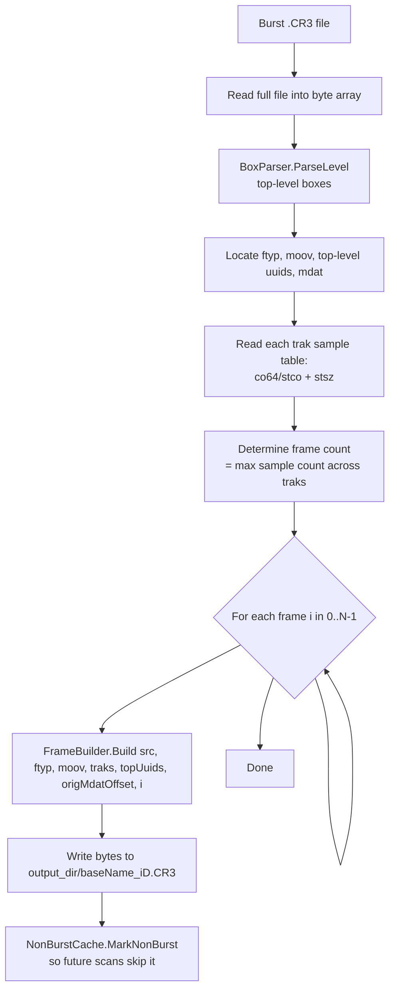
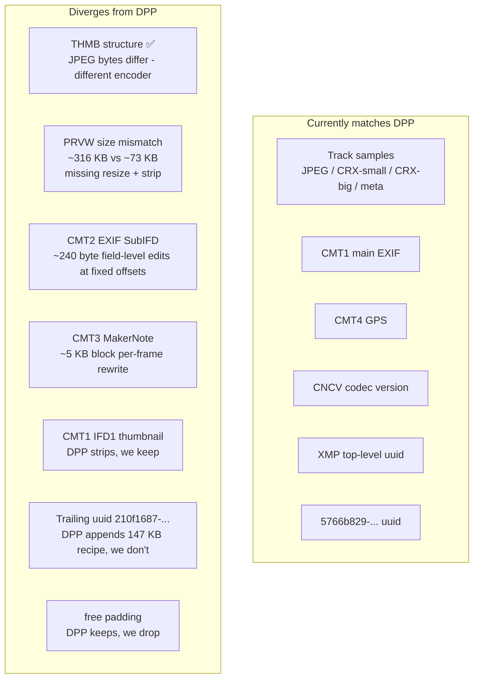

# 6. Extraction algorithm and DPP parity

This final chapter is the engineering blueprint: exactly how the extractor turns a burst file into N standalone CR3s, and where the result still diverges from Canon DPP's output.

## 6.1 High-level pipeline



All of this lives in `Managers/BurstExtractor.cs` and `Managers/FrameBuilder.cs`. The orchestration and per-file cache writing happens in `Managers/BurstExtractor.Extract`; the per-frame byte construction happens in `FrameBuilder.Build`.

## 6.2 Building one frame's CR3 — step by step

This is the meat of the algorithm. Pseudocode (matching `FrameBuilder.Build`):

```
1.  Collect this frame's per-track sample bytes:
        for ti in 0..traks.Count-1:
            stbl = trak[ti].stbl
            offset = (co64 ?? stco)[frameIdx]
            size   = stsz[frameIdx]
            frameSamples[ti] = src[offset .. offset+size]

2.  Find the per-frame JPEG (track 0's sample is a JPEG starting FF D8 FF):
        frameJpeg = PrvwBuilder.FindJpegSample(frameSamples)

3.  Clone moov with single-sample tables + per-frame THMB:
        patchedMoov = MoovBuilder.BuildPatched(src, moovBox, frameSamples,
                                               frameIdx, frameJpeg)

4.  Carry over top-level uuids verbatim:
        uuidBytes[i] = BoxQuery.GetRawBox(src, topUuids[i])

5.  Rebuild PRVW per-frame (replace JPEG inside the PRVW uuid):
        for each uuidBytes[i] whose UUID == PRVW:
            uuidBytes[i] = PrvwBuilder.BuildWithJpeg(uuidBytes[i], frameJpeg)

6.  Compute new file layout:
        ftyp_size = 24
        cursor    = ftyp_size + moovSize
        for each kept top-level uuid:
            offsetMap[origOffset] = (cursor, uuidBytes.Length)
            cursor += uuidBytes.Length
        mdatBoxOffset      = cursor
        mdatPayloadOffset  = mdatBoxOffset + 8
        offsetMap[origMdatBoxOffset] = (mdatBoxOffset, mdatBoxSize)

7.  Patch offsets in patched moov:
        BoxPatcher.PatchOffsets(patchedMoov, frameSamples, mdatPayloadOffset)
            → for each track, write the new co64/stco entry
        BoxPatcher.PatchCtbo(patchedMoov, offsetMap)
            → for each CTBO entry, update (origOffset → newOffset/newSize)
        BoxPatcher.PatchCctp(patchedMoov)
            → flip roll flag 2→1 in CCTP

8.  Assemble output bytes:
        ftyp                                         (24 B fresh)
        patchedMoov                                  (computed)
        each top-level uuidBytes                     (verbatim or per-frame PRVW)
        mdat box header (size + 'mdat')              (8 B)
        each frameSamples[i].Data                    (concat in track order)

9.  Return assembled byte[] → File.WriteAllBytes
```

## 6.3 The role of `MoovBuilder.BuildPatched`

`MoovBuilder` is where the heaviest restructuring happens. It walks each direct child of `moov`:

| moov child | Action |
| --- | --- |
| `trak` | `WritePatchedTrak` — descend through `tkhd` (patch duration), `mdia` → `mdhd` (patch duration), `mdia` → `minf` → `stbl` (rewrite to single sample) |
| `mvhd` | Patch movie duration to one frame |
| `uuid` (Canon wrapper) + `frameJpeg != null` | `RebuildMoovUuidWrapperWithPerFrameThmb` — parse the wrapper's children, swap THMB through `ThmbBuilder.BuildWithJpeg`, copy the rest verbatim, re-emit the wrapper |
| anything else | Copy verbatim |

The wrapper rebuild is necessary because THMB isn't a direct child of `moov` — it's two levels deep (`moov` → `uuid` Canon wrapper → `THMB`). To rewrite THMB you must rebuild the wrapper, which means recomputing the wrapper's outer size.

## 6.4 Where we currently match DPP byte-for-byte

The test suite measures this for 5 frames of the primary burst (`375A4182`) and 2 frames of the secondary burst (`375A7575`). Currently passing tests (53 tests in `ExtractionTests`):

- `TrackSamplesMatchDpp` — every track's sample bytes are byte-identical to DPP for every tested frame. This includes the CRX-big RAW (which is what RAW developers actually decode), the CRX-small preview, the embedded JPEG, and the metadata track sample.
- `PrvwJpegMatchesDpp` — passes only because DPP's PRVW is detected as "not present" by our extractor (the offsets are read via `PrvwBuilder`'s layout assumptions which don't match DPP's slimmer PRVW). Once we fix the extractor to find DPP's PRVW, this test will likely start failing until we resize+strip our own PRVW.
- `OurThmbExistsWhenDppHasIt` — both have THMB ✅.
- `OurThmbIsPerFrame` — our extracted frame 1 and frame 4 have **different** THMB bytes ✅.
- `Cmt1MatchesDpp` — verbatim copy ✅.
- `Cmt4MatchesDpp` — verbatim copy ✅.
- `CncvMatchesDpp` — verbatim copy ✅.
- `XmpUuidMatchesDpp` — verbatim copy ✅.
- `ExifIfd1ThumbnailMatchesDpp` — passes only because DPP omits IFD1, so our short-circuit fires.

## 6.5 Known divergences



### 6.5.1 THMB JPEG bytes

Our THMB JPEG is **structurally correct** (24-byte header, no JFIF marker, ~3.5 KB JPEG) and **per-frame**, but the actual JPEG bytes don't match DPP's because:

- We use `System.Drawing`'s JPEG encoder at quality 80.
- DPP uses Canon's own encoder, which has different quantization tables and Huffman codes.

Functional impact: zero. Both produce valid 160×120 JPEGs that load fast.

### 6.5.2 PRVW size mismatch

Our PRVW currently wraps the full ~100 KB track-0 JPEG, producing a ~316 KB PRVW uuid. DPP's PRVW is ~73 KB. The same `resize → re-encode → StripAppMarkers` pipeline that fixed THMB would fix PRVW; the change is a ~15-line update to `PrvwBuilder.BuildWithJpeg`.

This is the prime suspect for the still-failing **DPP edit-view** symptom. DPP may validate PRVW JPEG markers the same way it validates THMB and reject our oversized JFIF-marked version.

### 6.5.3 CMT2 — field-level EXIF SubIFD edits

DPP makes a consistent set of edits at 74 byte ranges totaling ~240 bytes (verified across two different bursts at **identical offsets**). The edits are at TIFF tag value positions, so they're likely:

- Updating `DateTimeOriginal` (per-shot timestamp) — but the same across all DPP frames in one burst, so this is roll-level
- Updating EXIF `SubsecTimeOriginal`
- Updating `ImageNumber`, `ImageUniqueID`
- Possibly zeroing some Canon-specific timestamps

To replicate: parse the CMT2 TIFF IFD, walk to the same field positions, and apply the same byte deltas. Tagged as `[Theory(Skip = ...)]` in the test suite.

### 6.5.4 CMT3 — per-frame Canon MakerNote rewrite

The biggest unresolved item. DPP per-frames CMT3 in a large block starting at byte +1144 (~5 KB of differences). Strong hypothesis: Canon's MakerNote tags contain N-element arrays (one entry per burst frame) and DPP selects element N for frame N.

The MakerNote has a standard TIFF IFD structure, so parsing it is mechanically doable. The hard part is knowing which tags hold per-frame arrays — Canon doesn't document this, and `ExifTool`'s tag dictionary doesn't cover RAW Burst variants. Likely candidates:

- `0x0001` CameraSettings (variable per shot)
- `0x0004` ShotInfo (likely contains per-frame data — focus position, BV, TvAv)
- `0x0007..0x0010` various exposure-related arrays
- `0x4001..0x4023` ColorBalance and related

This is the most likely cause of **DPP full-edit-view failing to render** ("?") — DPP's RAW decoder may consult MakerNote tags for white balance, color matrices, and per-frame AF data.

### 6.5.5 EXIF IFD1 thumbnail

We keep IFD1 with its small EXIF thumbnail JPEG; DPP strips IFD1 (sets IFD0's next-IFD offset to 0). Stripping would be ~10 lines but our last attempt regressed Lightroom — needs to be re-attempted **without** simultaneous changes elsewhere so the cause-effect is clearer.

### 6.5.6 Trailing `uuid 210f1687-...` (147 KB)

DPP appends this after `mdat`. Likely a DPP recipe / sidecar block (white-balance, picture style, edit history). The file is otherwise functional without it for Lightroom and DPP thumbnails; whether DPP's edit view requires it is untested.

### 6.5.7 `free` padding

DPP and the burst both write a top-level `free` box (~25 KB) between the top-level uuids and `mdat`, presumably for `mdat` alignment. We don't write one. No reader complains.

## 6.6 Compatibility matrix as of v0.1

| Reader | Thumbnail grid | Develop / edit view | Notes |
| --- | --- | --- | --- |
| **Adobe Lightroom** | ✅ per-frame thumbnails after THMB fix | ✅ correct per-frame RAW decode | Best supported |
| **Adobe Camera Raw** | ✅ | ✅ | Same engine as Lightroom |
| **Adobe DNG Converter** | n/a | ✅ converts to DNG | Originally regressed by `free` boxes inside `stbl`; fixed by stripping them |
| **Canon DPP** | ✅ after THMB layout + `StripAppMarkers` fix | ❌ shows `?` | Likely PRVW APP-marker strip + CMT3 per-frame rewrite needed |
| **darktable** | ✅ | ✅ | Uses rawspeed; mature CR3 reader |
| **Windows Explorer thumbnails** | ✅ | n/a | Uses THMB / IFD1 |
| **ExifTool** | n/a | ✅ reads metadata | Verbose, accepts our CMT1/CMT2/CMT3/CMT4 structure |

## 6.7 Where to push next (in priority order)

If you want to improve DPP parity, this is the rough sequence:

1. **PRVW resize + APP-marker strip** (~15 LOC). Probably fixes DPP's edit-view `?`.
2. **CMT1 IFD1 strip** — set IFD0's next-IFD offset to 0 in CMT1 (~10 LOC). Matches DPP's "no IFD1 thumbnail" behaviour.
3. **CMT2 field-level patcher** — apply the ~240 bytes of fixed-offset edits DPP applies. Either:
   - Reverse-engineer which TIFF tags DPP edits and what values it writes, or
   - Cheat: capture DPP's per-burst CMT2 byte delta once and apply it on extraction (would require having DPP run first).
4. **CMT3 per-frame patcher** — the big one. Parse Canon MakerNote, identify per-frame array tags, select element N. Significant work; probably requires reverse-engineering one burst with ExifTool side-by-side.
5. **Trailing `210f1687` uuid** — write an empty/skeleton block to match DPP layout. Probably cosmetic.

Each step has tests in `ExtractionTests.cs` ready to gate it — just remove the `Skip` argument and start the cycle of test-fail → patch → test-pass.

## 6.8 Closing thoughts

The format itself is well-structured once you know where to look — ISO BMFF wraps everything, Canon's additions are clearly demarcated by their custom box names and UUIDs, and the burst-vs-single difference is mostly localized to sample tables and `THMB`/`PRVW` rewrites. The hard part isn't structural; it's the unwritten contracts each downstream reader has about what "valid" looks like at the byte level — particularly Canon DPP, which is the strictest reader and the only one that produces files we can use as a ground truth.

The test suite in `Cr3BurstExtractor.Tests/ExtractionTests.cs` codifies what we've learned. Any future work on this format should start by adding a test (or unskipping one of the existing ones), running it to see the byte-level mismatch, and iterating until green.
