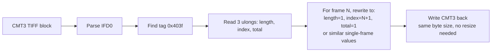

# 7. Conformance to the lclevy/canon_cr3 specification

This chapter cross-references our implementation against the reference specification at [lclevy/canon_cr3](https://github.com/lclevy/canon_cr3). It documents where we conform, where we deviate (with rationale), and what the spec teaches us that we haven't yet acted on.

The verification was done on **2026-06-07** against the spec README and our code at that point.

## 7.1 Box hierarchy and UUIDs

### Top-level boxes

| Box | Spec says | We do | Conformant? |
| --- | --- | --- | --- |
| `ftyp` | First box, brand `crx ` | Emit 24-byte `ftyp` with brands `crx `, `crx `, `isom` via `SampleTableWriter.WriteFtyp` | ✅ |
| `moov` | Container with metadata, including 4–5 traks | Build patched `moov` via `MoovBuilder.BuildPatched` | ✅ |
| top-level `uuid` (XMP) | `be7acfcb-97a9-42e8-9c71-999491e3afac` | Carried over verbatim | ✅ |
| top-level `uuid` (PRVW) | `eaf42b5e-1c98-4b88-b9fb-b7dc406e4d16`, contains inner `PRVW` (JPEG 1620×1080) | Carried over, JPEG replaced per-frame via `PrvwBuilder.BuildWithJpeg` | ✅ structure / ⚠️ payload not yet resized to match DPP |
| top-level `uuid` (CMTA wrapper) | `5766b829-bb6a-47c5-bcfb-8b9f2260d06d`, "used in burst rolls, contains CMTA" | Carried over verbatim (opaque, ~584 KB) | ✅ |
| top-level `uuid` (CNOP wrapper) | `210f1687-9149-11e4-8111-00242131fce4`, "optional data in roll, contains CNOP" | **Not written** — and not present in our source bursts either | ⚠️ See §7.5 |
| `mdat` | Image data payload | Single-sample mdat assembled from chosen frame's track samples | ✅ |

### Canon moov.uuid wrapper

Spec: the wrapper UUID inside `moov` is `85c0b687-820f-11e0-8111-f4ce462b6a48`.

Our `MoovBuilder.RebuildMoovUuidWrapperWithPerFrameThmb` preserves these 16 bytes verbatim from the source. ✅

### Inner Canon boxes (within moov.uuid)

| Box | Spec | Our handling | Match |
| --- | --- | --- | --- |
| `CNCV` | "Canon Compressor Version", e.g. `CanonCR3_001/01.09.00/01.00.00` for burst | Copied verbatim | ✅ |
| `CCTP` | Header `size+'CCTP'+long(0)+long(1)+ccdtCount`, followed by CCDT entries | Copied verbatim. Then `BoxPatcher.PatchCctp` overwrites the long at offset +8 from 2→1. See §7.3 | ✅ structure, ⚠️ patch not in spec |
| `CCDT` | 24-byte entry: `tag size + 'CCDT' + image type (8B) + 0 (4B) + trak index (4B)` | Implicit; copied as part of `CCTP` verbatim | ✅ |
| `CTBO` | Header `size+'CTBO'+count`, then 20-byte records `index(4)+offset(8)+size(8)` | Found via byte scan; each record's offset/size re-pointed via `BoxPatcher.PatchCtbo` using `(originalOffset → newOffset/newSize)` map | ✅ exact byte layout |
| `CMT1` | EXIF IFD0 (TIFF) | Copied verbatim | ✅ |
| `CMT2` | EXIF ExifIFD (SubIFD) | Copied verbatim | ⚠️ DPP edits ~240 B per frame; we don't (test `Cmt2MatchesDpp` skipped) |
| `CMT3` | Canon MakerNotes (TIFF). Tag `0x403f` holds **Roll Info**: 3 ulongs (length, picture index, total) | Copied verbatim | ⚠️ DPP per-frames this; spec gives us tag `0x403f` as a concrete starting point (see §7.6) |
| `CMT4` | EXIF GPS IFD | Copied verbatim | ✅ |
| `THMB` | 24-byte header + JPEG (160×120) | See §7.2 — fully byte-for-byte conformant for version 0 | ✅ |
| `CNOP` | "Canon Optional data" (unknown content, in roll files) | Copied verbatim (176 B in our source bursts) | ✅ |

## 7.2 THMB byte layout — exact match

Spec layout vs. our `ThmbBuilder.cs`:

| Offset | Spec field | Spec width | Our write/read |
| --- | --- | --- | --- |
| +0 | `size` | long (4 B BE) | We write the recomputed total |
| +4 | `'THMB'` | 4 B | Preserved verbatim from `origThmb[4..8]` |
| +8 | `version` | 1 B (0 or 1) | Preserved as part of `origThmb[4..16]` |
| +9 | `flags` | 3 B (value = 0) | Preserved |
| +12 (0xc) | `width` | short (2 B BE) | Preserved |
| +14 (0xe) | `height` | short (2 B BE) | Preserved |
| +16 (0x10) | `jpeg_size` | long (4 B BE) | We write the new payload length |
| +20 (0x14) | `unknown=1` | short (2 B) — **v0 only** | Preserved from `origThmb[20..24]` |
| +22 (0x16) | `unknown=0` | short (2 B) — **v0 only** | Preserved |
| +24 (0x18) | `jpeg_data` (`FF D8 … FF D9`) | `jpeg_size` bytes | We write the resized + APP-stripped JPEG |

Header total = 24 B. Matches our `ThmbBuilder.HeaderTotal = 24` constant.

Verified empirically via `Diagnose_ThmbHeaderLayout` against burst, DPP, and our own output — all three start with the same 24-byte structure ending in `FF D8 FF DB …`.

### ⚠️ Version 1 caveat

The spec notes the two `short` fields at +20 and +22 are **version 0 only**. Our R6 Mark II test data uses version 0 everywhere. If a future Canon body writes a version-1 THMB, the JPEG would start at +20 and our `BuildWithJpeg` would corrupt the box by writing 4 bytes of v0-style "constant" into what's actually JPEG data.

A safer implementation would read `version` at +8, then branch on header length (24 for v0, 20 for v1). Not done today.

## 7.3 CCTP flag patch — empirical, not in spec

Spec layout for CCTP:

```
+0   size       (long)
+4   'CCTP'     (4 B)
+8   0          (long)
+12  1          (long)
+16  ccdtCount  (long)
+20  CCDT entries...
```

The spec describes `+8 = 0` and `+12 = 1` as fixed values.

Our `BoxPatcher.PatchCctp` writes `1` at **offset +8 from `'CCTP'`** (so byte offset +12 from start-of-box if you include the 4-byte size). The accompanying comment says:

> The `flag` field is 2 in a raw-burst roll and 1 in a single still — Canon DPP sets it to 1 when it extracts a frame.

This is **observation-derived**, not from lclevy's spec. Possible explanations:

1. **Spec is silent on burst-vs-single semantics.** The spec was largely written from non-burst sample files where this field was always 1. In burst rolls the byte at +8 from `'CCTP'` is **2**, signalling "multi-frame roll". DPP flips it to 1 when extracting. Our patch matches DPP's behaviour.

2. **We're patching the wrong byte.** If our offset math is off, we might be overwriting `+12 = 1` instead of `+8 = 0`. But empirically this patch causes Adobe Camera Raw to accept the file (it rejected it before the patch with "unsupported file"), so we're patching *something* meaningful at this location.

Action: leave the patch in place (functional behaviour is correct), but the spec should ideally be amended with a note about the burst/single flag. Not a deviation from the spec so much as a refinement.

## 7.4 CTBO records — exact match

Spec record (20 bytes each):

```
+0   index   (long)        // 1-based: 1=xpacket, 2=preview, 3=mdat, 4=zero entry, 5=CMTA
+4   offset  (longlong)
+12  size    (longlong)
```

Our `BoxPatcher.PatchCtbo` reads/writes at exactly these offsets. The dispatch is by **original file offset** (matched against `offsetMap`), not by index — but the indices align naturally because we keep the same boxes in the same order. Index 4 ("zero entry") has offset=0/size=0 in the source; we don't put 0 in `offsetMap`, so that record is left untouched. ✅

## 7.5 The trailing `210f1687-...` uuid — DPP, not roll

Spec: "`210f1687-9149-11e4-8111-00242131fce4` — optional data in roll, contains CNOP."

Our box dumps tell a different story:

| File | Contains 210f1687 top-level uuid? | `moov.uuid.CNOP`? |
| --- | --- | --- |
| Burst `375A4182.CR3` (R6 Mark II) | **No** | Yes (176 B) |
| DPP-extracted `375A4182_01.CR3` | **Yes** (147 KB at file tail) | Yes (176 B) |
| Our extracted `375A4182_01.CR3` | No | Yes (176 B) |

So on the R6 Mark II at least, the `210f1687` top-level uuid is **emitted by DPP** during extraction — it's not in the source burst. Possible explanations:

- The spec was written against an older body (M6 Mark II, G7X Mark II) that writes `210f1687` at top level in burst rolls.
- The R6 Mark II writes `CNOP` only inside `moov.uuid` (176 B) and DPP repackages it (or a different recipe block) into a top-level `210f1687` uuid on extraction.
- The 147 KB DPP block is something else entirely — a DPP-specific edit recipe / sidecar — and not CNOP at all.

We don't currently write it. Files open correctly in Lightroom without it. DPP's edit-view failure ("?") could conceivably be tied to its absence; investigating this is on the TODO list in [§6](06-extraction-and-dpp-parity.md).

## 7.6 CMT3 — the spec hands us a concrete starting point

The spec mentions a single CMT3 tag that's per-frame:

> **CMT3 tag 0x403f** holds Roll Info as 3 ulongs: current picture index, total images in roll (e.g., "12 15 36" = length 12, picture #16, 36 total).

This is **directly actionable** for CMT3 per-frame parity:



When `Cmt3MatchesDpp` is unskipped and we attempt to converge, this is the **first** edit to try. If DPP changes only this tag's value (3 ulongs × 4 bytes = 12 bytes), our diff against DPP for frame 1 vs frame 4 should drop dramatically (we currently see ~5 KB differing, but most of that is probably AF / autofocus per-frame data and may not be needed for DPP edit-view to work).

The spec doesn't list other per-frame tags explicitly, so additional reverse engineering (or ExifTool with `-MakerNotes:all`) is still needed to identify any further per-frame fields DPP rewrites.

## 7.7 CTMD track (track #4) — per-frame metadata, already correct

Spec: "CTMD trak#4 inside moov holds per-frame timed metadata (timestamps, focal length, exposure, Exif blocks of types 1, 3, 4, 5, 7, 8, 9)."

Our `FrameBuilder.Build` reads sample N from **every** track including track 4, so per-frame CTMD metadata is preserved correctly. We don't decode the CTMD payload — we just slice its bytes from the source `mdat` and write them into the new `mdat`.

This is implicitly verified by `TrackSamplesMatchDpp` which checks every track's sample 0 byte-for-byte against DPP across 5 reference frames — track 3 (CTMD) included. ✅

## 7.8 Track index ↔ purpose mapping

Spec: "track1=jpeg, track2=sd raw, track3=hd raw, track4=CTMD, track5=dual pixel".

ISO BMFF tracks are 1-indexed in the spec. In our code (`FrameBuilder.Build`) the `traks` list is 0-indexed:

| Spec track # | Our `traks` index | Sample contents | Used as |
| --- | --- | --- | --- |
| 1 | `traks[0]` | JPEG embedded preview (~100 KB) | Source for THMB and PRVW JPEGs |
| 2 | `traks[1]` | CRX-small preview | Carried over as-is |
| 3 | `traks[2]` | CRX-big RAW | The actual photo |
| 4 | `traks[3]` | CTMD per-frame metadata | Carried over as-is |
| 5 (dual-pixel only) | `traks[4]` (if present) | Dual-pixel CRX | Would be carried over |

Our extraction code doesn't hard-code track indices; it iterates `traks` in order. So if a dual-pixel body produces a 5th track, the iteration handles it automatically. (Untested — no dual-pixel test files yet.)

## 7.9 Encoding type and CRX codec

Spec: extracted pictures from burst use "encoding type 3, likely YCrCb format and 10 bits".

This is a property of Canon's CRX codec inside the sample bytes themselves — entirely opaque from our perspective. We don't decode or re-encode CRX; we just slice + concatenate sample bytes. The encoding type field lives inside `stsd → CRAW → CMP1` which we copy verbatim. ✅

## 7.10 Number of pictures in a roll

Spec: "up to 70 pictures (from M6 Mark II, G7X Mark II)" for `CSI_*.CR3` rolls.

Our R6 Mark II test bursts contain up to 39 frames in one roll. `BurstExtractor.GetFrameCount` reads the maximum sample count across all traks and returns it, so any future limit increase is automatically handled. ✅

## 7.11 Conformance summary

| Area | Conformance |
| --- | --- |
| File / box structure (top level + moov) | ✅ exact |
| moov.uuid wrapper UUID | ✅ exact |
| All top-level uuid identifiers | ✅ exact |
| THMB byte layout (v0) | ✅ exact |
| THMB v1 layout | ⚠️ not handled (untested in the wild) |
| CTBO record layout and offset patching | ✅ exact |
| CCTP byte layout | ✅ exact |
| CCTP roll/single flag (empirical) | ✅ functional, not formally in spec |
| CMT1 / CMT4 contents | ✅ verbatim, matches DPP |
| CMT2 contents | ✅ verbatim from spec POV; ⚠️ doesn't match DPP's edits |
| CMT3 contents | ✅ verbatim from spec POV; ⚠️ doesn't match DPP's per-frame edits; spec tag `0x403f` is the documented starting point |
| CMT3 Roll Info tag 0x403f | ❌ not yet rewritten — concrete TODO |
| CNOP | ✅ verbatim |
| Top-level `210f1687` uuid (CNOP wrapper / DPP recipe) | ❌ not written — see §7.5 for discussion |
| CTMD per-frame metadata (track 4) | ✅ per-frame sample preserved |
| ftyp brands | ✅ matches |
| Track ordering and purpose | ✅ matches |
| CRX codec / encoding type | ✅ verbatim (opaque to us) |

**Overall**: our implementation conforms to the lclevy spec wherever the spec applies. The few areas where we deviate are either:

1. **Empirical refinements** the spec doesn't cover (CCTP +8 burst/single flag).
2. **Known TODOs** we've already documented in [§6](06-extraction-and-dpp-parity.md) (CMT2 field edits, CMT3 per-frame, top-level `210f1687`).

The spec gives us **one concrete actionable lead** we hadn't yet identified through reverse engineering: **CMT3 tag 0x403f (Roll Info)**. This is the first thing to try when reopening the `Cmt3MatchesDpp` test.
